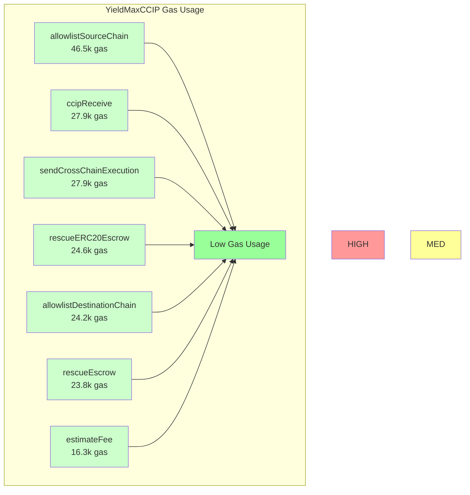

# Bundefi (Ym.sol)

> **Note:**
> The project is now called **Bundefi**, but the main contract is still named `ym.sol` (short for YieldMax) — old habits die hard! 😄

## What is `ym.sol`?

The [`src/ym.sol`](./src/ym.sol) contract (originally YieldMaxCCIP) is the core of Bundefi's cross-chain DeFi automation. It leverages Chainlink CCIP to securely execute complex, multi-step DeFi strategies across multiple blockchains.

### Key Features
- **Cross-Chain Execution:** Uses Chainlink CCIP to send and receive cross-chain messages and assets, enabling automated DeFi actions on any allowlisted chain.
- **Executor Pattern:** Deploys isolated executor contracts for each cross-chain call, ensuring safe, atomic execution and easy recovery from failures.
- **Escrow & Safety:** Handles both native and ERC20 escrow, with robust error handling, failed message recovery, and emergency withdrawal features.
- **Gas & Chain Allowlisting:** Enforces gas safety bounds and restricts execution to allowlisted source/destination chains for security.
- **Multicall Support:** Supports multicall contracts via delegatecall for efficient batch execution.

### Where to Find It
- Main contract: [`src/ym.sol`](./src/ym.sol)
- Executor template: defined at the bottom of the same file

---

The rest of this README covers the original Chainlink CCIP starter kit and usage instructions. For Bundefi's custom logic, see [`src/ym.sol`](./src/ym.sol)!

## Chainlink CCIP Starter Kit

> **Note**
>
> _This repository represents an example of using a Chainlink product or service. It is provided to help you understand how to interact with Chainlink's systems so that you can integrate them into your own. This template is provided "AS IS" without warranties of any kind, has not been audited, and may be missing key checks or error handling to make the usage of the product more clear. Take everything in this repository as an example and not something to be copy pasted into a production ready service._

This project demonstrates a couple of basic Chainlink CCIP use cases.

## Table of Contents

1. [Chainlink CCIP Starter Kit](#chainlink-ccip-starter-kit)
   - [Note](#note)
2. [Prerequisites](#prerequisites)
3. [Getting Started](#getting-started)
   - [Install packages](#install-packages)
   - [Compile contracts](#compile-contracts)
4. [What is Chainlink CCIP?](#what-is-chainlink-ccip)
5. [Usage & Environment Variables](#usage--environment-variables)
6. [Chain Configurations](#chain-configurations)
7. [Testing](#local-testing)
   [Faucet](#faucet)

8. [Production Best Practice](#production-best-practice)
9. [Example 1 - Transfer CCIP Test Tokens from EOA to EOA](#example-1---transfer-tokens-from-eoa-to-eoa)
10. [Example 2 - Transfer Tokens from EOA to Smart Contract](#example-2---transfer-tokens-from-eoa-to-smart-contract)
11. [Example 3 - Transfer Token(s) from Smart Contract to any destination](#example-3---transfer-tokens-from-smart-contract-to-any-destination)
12. [Example 4 - Send & Receive Tokens and Data](#example-4---send--receive-tokens-and-data)
13. [Example 5 - Send & Receive Cross-Chain Messages and Pay with Native Coins](#example-5---send--receive-cross-chain-messages-and-pay-with-native-coins)
14. [Example 6 - Send & Receive Cross-Chain Messages and Pay with LINK Tokens](#example-6---send--receive-cross-chain-messages-and-pay-with-link-tokens)
15. [Example 7 - Execute Received Message as a Function Call](#example-7---execute-received-message-as-a-function-call)

## Prerequisites

- [Foundry](https://book.getfoundry.sh/getting-started/installation)

## Getting Started

1. Install packages

```
forge install
```

and

```
npm install
```

2. Compile contracts

```
forge build
```


## ⛽ Gas Usage Analysis

*Last updated: 6/23/2025, 9:25:09 PM*

### Gas Usage Overview



### Detailed Gas Report

| Function | Current Gas | Previous Gas | Change | Description |
|----------|-------------|--------------|--------|-------------|
| allowlistSourceChain | 46,481 | 46,481 | +0.0% 🟡 | Add/remove source chain from allowlist |
| ccipReceive | 27,883 | 27,883 | +0.0% 🟡 | Receive and process cross-chain message |
| sendCrossChainExecution | 27,854 | 27,854 | +0.0% 🟡 | Send cross-chain execution with tokens |
| rescueERC20Escrow | 24,575 | 24,575 | +0.0% 🟡 | Rescue escrowed ERC20 tokens |
| allowlistDestinationChain | 24,200 | 24,200 | +0.0% 🟡 | Add/remove destination chain from allowlist |
| rescueEscrow | 23,809 | 23,809 | +0.0% 🟡 | Rescue escrowed native tokens |
| estimateFee | 16,257 | 16,257 | +0.0% 🟡 | Estimate cross-chain execution fee |


### Gas Optimization Notes

- **Contract Deployment**: One-time cost for deploying the YieldMaxCCIP contract
- **Cross-Chain Operations**: Higher gas due to CCIP message encoding and security checks
- **Chain-Only Validation**: Optimized approach removes per-sender validation overhead
- **Executor Pattern**: Isolated execution environment adds gas but provides better security

### Running Gas Analysis

```bash
# Generate gas report
npm run gas-report

# Update README with latest gas data
npm run update-readme
```

---

